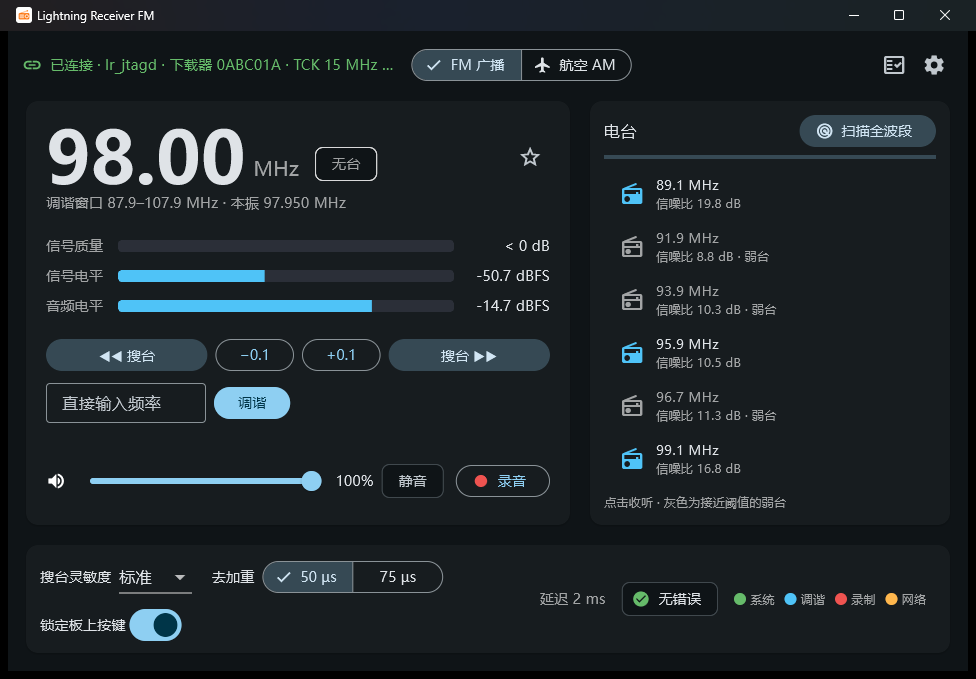
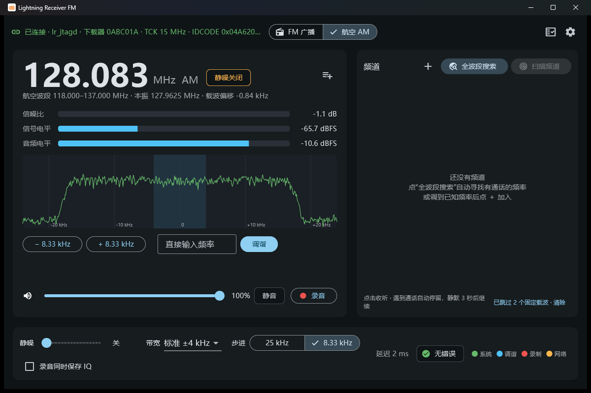

# Lightning Receiver

**FPGA software-defined radio receiver — Xilinx Kintex UltraScale+ KU5P + AD9361**
**基于 Xilinx KU5P + AD9361 的 FPGA 软件无线电接收机**

FM broadcast radio and airband (aviation) AM receiver with a Windows desktop app. The PC talks to the FPGA over the board's own USB-JTAG cable — no Vivado needed at runtime.

FM 广播收音机 + 航空波段 AM 接收机，配套 Windows 桌面 App。电脑通过板载 USB-JTAG 与 FPGA 通信，运行时不需要 Vivado。

[English](#english) · [中文](#中文)

| FM broadcast / FM 广播 | Airband AM / 航空波段 |
|---|---|
|  |  |

---

## English

### Features

**FM broadcast radio (demodulated in the FPGA)**
- 87.5–108 MHz reception; tuning, hardware auto-seek (like a pocket radio: press once, it stops on the next station), ±0.1 MHz steps, direct frequency entry.
- Full-band scan with a station list (signal quality per station) and favorites.
- Signal quality (CNR), signal level and audio level meters.
- De-emphasis 50 µs (China/Europe) or 75 µs (Americas/Korea), seek sensitivity.
- Real-time playback (latency of a few ms) and WAV recording.
- Board keys and LEDs work as a stand-alone radio (see [Front panel](#front-panel)).

**Airband AM (118–137 MHz)**
- The FPGA delivers 48 kS/s complex baseband; demodulation runs in the app: channel filter (±3 / ±4 / ±6 kHz), AM envelope detection, automatic level control, 300–3000 Hz voice filter, squelch.
- 25 kHz or 8.33 kHz channel steps, live ±24 kHz baseband spectrum, carrier-offset readout.
- **Full-band search**: sweeps the whole band, stops on a call, and adds the frequency to your channel list automatically; steady carriers (local interference) are skipped.
- **Channel scan** over your saved channels (tower, ground, approach, ATIS …).
- Recording of the demodulated audio, optionally also the raw IQ (stereo WAV).

**App**
- One-click installer; a start-up self-test checks audio → JTAG cable → FPGA design → clock/DDR → AD9361 → RF → network and tells you exactly what is wrong and how to fix it; it retries automatically.
- The RF front end (AD9361) is initialised automatically (~4 s).

### Hardware

| Item | Used here |
|---|---|
| FPGA board | RK-XCKU5P-F (Xilinx `xcku5p-ffvb676-2-i`), DDR4, on-board FT2232H USB-JTAG/UART, 4 keys / 4 LEDs |
| RF daughterboard | FMC AD936X (AD9361, 70 MHz–6 GHz), antenna on **RX1A** |
| Antenna | FM: ~75 cm whip; airband: ~57 cm vertical (¼ λ), ideally at a window or outdoors |
| PC | Windows 10/11 x64, FTDI D2XX driver (installed with Vivado/Vivado Lab or from ftdichip.com) |
| Optional | QSFP28 100G link to a 100G NIC for network streaming |

### Quick start

1. **Program the FPGA** with `lr_fm_air_4C520005.bit` from [Releases](../../releases) (Vivado or Vivado Lab Hardware Manager → *Program Device*). **Close the Hardware Manager afterwards** — it keeps the JTAG cable busy.
2. Connect the antenna to **RX1A** and the board's USB-C (JTAG) to the PC.
3. Install and start **`LR_Radio_Setup_x.y.z.exe`** from [Releases](../../releases).
4. The self-test runs; when every line is green the radio screen opens. If a line fails, follow the hint shown under it (e.g. *"JTAG cable busy — close Vivado Hardware Manager"*).

### Using the app

The app's interface is in Chinese; button names are given below as *English (中文)*.

**FM**
- *Seek (◀◀ 搜台 / 搜台 ▶▶)* or PgDn / PgUp: hardware seek to the next station. *−0.1 / +0.1* or ← / →: manual step.
- *Scan full band (扫描全波段)*: builds the station list; click a station to listen; ☆ adds a favorite.
- Typing a frequency outside the current ±10 MHz window moves the RF local oscillator (asks first, ~4 s).
- Bottom bar: seek sensitivity (搜台灵敏度), de-emphasis (去加重 — use **75 µs in Korea / the Americas**), lock board keys (锁定板上按键), error indicator (click to clear), board LED mirror.

**Airband**
- Switch with **FM 广播 / 航空 AM** at the top (~4 s; the board keys are locked in airband mode).
- Tune with the *± 25 kHz / ± 8.33 kHz* buttons (← / →) or type a frequency (直接输入频率, 118.000–137.000).
- **Squelch (静噪)**: off (关), or 4–20 dB above the noise floor (6 dB is a good start). The badge shows *有通话* (call) / *静默* (quiet).
- **Full-band search (全波段搜索)** finds active frequencies for you; **Scan channels (扫描频道)** cycles through your list (add entries with ＋). Both stop on a call and continue 3 s after it ends (PgUp / PgDn toggles the scan).
- Use the spectrum while adjusting the antenna: a real station shows up as a vertical line at 0 Hz.
- Tip: aviation signals are weak and vertically polarised — put the antenna at a window or outdoors. Many countries allow listening but forbid publishing or using the content of aviation communications.

**Files**: settings and lists in `%APPDATA%\LightningReceiver`, recordings in `Music\LightningReceiver`.

### Front panel

Works in FM mode without a PC (with the app connected the app has priority).

| Key | Short press | Long press (≥ 0.5 s) |
|---|---|---|
| KEY1 | Seek down | −100 kHz, repeats while held |
| KEY2 | Seek up | +100 kHz, repeats while held |
| KEY3 | DDR recording on/off | — |
| KEY4 | Network audio on/off | — |
| KEY1 + KEY2 (1 s) | Back to the LO centre | |

| LED | Off | On | Slow blink | Fast blink |
|---|---|---|---|---|
| LED1 System | no clock | ready | DDR not calibrated | error pending |
| LED2 Tuning | no RF samples | station | no station | seeking |
| LED3 Recording | idle | recording | — | samples dropped |
| LED4 Network | network audio off | link up | link down | packets dropped |

### Command-line tools (`tools/hw/`)

| Tool | Purpose |
|---|---|
| `lr_jtagd.exe` | JTAG daemon (FT2232H MPSSE ↔ FPGA bridge), TCP 127.0.0.1:5555. `--probe` diagnoses the link step by step |
| `ad9361_jtag.exe` | AD9361 initialisation, e.g. `--lo-hz 97950000 --tune-hz 89100000` |
| `lr_record_audio.py` | Record FM to WAV: `--freq-mhz 89.1 --seconds 10 --out fm.wav` |
| `lr_air_survey.py` | Airband: `--iq-test`, `--survey 300` (find active channels), `--capture 126.4 10` (IQ WAV) |
| `lr_air_demod.py` | Demodulate an IQ WAV offline and report carrier/SNR (needs `numpy`, `scipy`) |

### Build from source

- **FPGA** (Vivado 2021.1): obtain the ADI HDL library (the `FMC_AD936X_PL` package or [analogdevicesinc/hdl](https://github.com/analogdevicesinc/hdl) branch `hdl_2021_r1`) into `fpga/vendor_reference/FMC_AD936X_PL/`; create a project for `xcku5p-ffvb676-2-i`; then in the Tcl console:
  ```tcl
  source tools/fpga/lr_sources.tcl
  source tools/fpga/lr_bd_s2.tcl
  source tools/fpga/lr_wrapper.tcl
  source tools/fpga/check_bd_current.tcl   ;# must print LR_CHECK_BD_OK
  source tools/fpga/impl_retry.tcl         ;# then synthesise and run lr_impl_with_retry
  ```
  The scripts currently assume the repository at `D:/workspace/LightningReceiver` (`lr_root` in `lr_sources.tcl`). RTL regression: `tools/fpga/run_rtl_regression.ps1` (25 xsim tests).
- **App**: Flutter 3.x + Visual Studio (C++ & CMake) + Inno Setup 6 → `app/lr_radio/installer/build_installer.ps1`.
- **Host tools**: MinGW-w64 gcc → `tools/hw/lr_jtagd/build.ps1`, `tools/hw/ad9361_jtag/build.ps1`.

Design notes, register map and the JTAG bridge protocol: [docs/DEVELOPMENT.md](docs/DEVELOPMENT.md) (Chinese).

### License

MIT — see [LICENSE](LICENSE). Third-party parts: [THIRD_PARTY_NOTICES.md](THIRD_PARTY_NOTICES.md).

---

## 中文

### 功能

**FM 广播收音机（在 FPGA 内解调）**
- 接收 87.5–108 MHz；硬件自动搜台（像半导体收音机一样按一下就停在下一个电台）、±0.1 MHz 步进、直接输入频率。
- 全波段扫描生成电台列表（含每个台的信号质量），可收藏电台。
- 信号质量（载噪比）、信号电平、音频电平显示。
- 去加重 50 µs（中国/欧洲）或 75 µs（美洲/韩国），可调搜台灵敏度。
- 实时播放（延迟几毫秒），可录音为 WAV。
- 板上按键和 LED 可以独立当收音机用（见[前面板](#前面板)）。

**航空波段 AM（118–137 MHz）**
- FPGA 输出 48 kS/s 复基带，解调在 App 里完成：信道滤波（±3 / ±4 / ±6 kHz）、AM 包络检波、自动音量、300–3000 Hz 语音滤波、静噪。
- 25 kHz / 8.33 kHz 步进，实时 ±24 kHz 基带频谱，显示载波偏移。
- **全波段搜索**：扫遍整个波段，遇到通话就停下，并把频率自动加入频道列表；持续不断的固定载波（本地干扰）会被自动跳过。
- **频道扫描**：在你保存的频道（塔台、地面、进近、ATIS……）之间轮流监听。
- 录制解调后的音频，也可同时保存原始 IQ（双声道 WAV）。

**App**
- 一键安装；启动自检依次检查 音频 → JTAG 下载器 → FPGA 设计 → 时钟/DDR → AD9361 → 射频 → 网络，出问题时直接告诉你原因和处理办法，并自动重试。
- 射频（AD9361）自动初始化，约 4 秒。

### 硬件

| 项目 | 本项目使用 |
|---|---|
| FPGA 开发板 | RK-XCKU5P-F（Xilinx `xcku5p-ffvb676-2-i`），DDR4，板载 FT2232H USB-JTAG/UART，4 个按键 / 4 个 LED |
| 射频子卡 | FMC AD936X（AD9361，70 MHz–6 GHz），天线接 **RX1A** |
| 天线 | FM：约 75 cm 拉杆天线；航空波段：约 57 cm 竖直天线（1/4 波长），最好放窗边或室外 |
| 电脑 | Windows 10/11 64 位，FTDI D2XX 驱动（装过 Vivado / Vivado Lab 就有，或到 ftdichip.com 下载） |
| 可选 | QSFP28 100G 连到 100G 网卡，用于网络传输 |

### 快速开始

1. 用 [Releases](../../releases) 里的 `lr_fm_air_4C520005.bit` **烧写 FPGA**（Vivado 或 Vivado Lab 的 Hardware Manager → *Program Device*）。**烧完请关闭 Hardware Manager**，否则它会一直占用 JTAG 下载器。
2. 天线接 **RX1A**，板子的 USB-C（JTAG）接电脑。
3. 从 [Releases](../../releases) 下载并安装 **`LR_Radio_Setup_x.y.z.exe`**，然后打开。
4. 自动进行启动自检，全部通过后进入收音机界面；某一项不通过时，按下面的提示处理即可（例如"JTAG 下载器被其他程序占用——请关闭 Vivado 的 Hardware Manager"）。

### 使用方法

**FM 广播**
- *◀◀ 搜台 / 搜台 ▶▶*（或 PgDn / PgUp）：硬件搜到下一个电台；*−0.1 / +0.1*（或 ← / →）：手动步进。
- *扫描全波段*：生成电台列表，点击即可收听；☆ 收藏。
- 输入超出当前 ±10 MHz 调谐窗口的频率时，会询问后重设射频本振（约 4 秒）。
- 底栏：搜台灵敏度、去加重（**韩国 / 美洲请选 75 µs**）、锁定板上按键、错误指示（点击清除）、板上 LED 镜像。

**航空波段**
- 顶部 **FM 广播 / 航空 AM** 切换（约 4 秒；航空模式下板上按键自动锁定）。
- 用 *± 步进*（← / →）调谐，或直接输入 118.000–137.000 之间的频率。
- **静噪**：关闭，或设为高出噪底 4–20 dB（建议从 6 dB 开始）。状态标签显示"有通话 / 静默"。
- **全波段搜索**自动帮你找有通话的频率；**扫描频道**在你的列表里轮询。两者都会在有通话时停下，通话结束 3 秒后继续（PgUp / PgDn 开始或停止扫描）。
- 调整天线时看频谱：真实电台会在 0 Hz 处出现一根竖线。
- 提示：航空信号弱且为垂直极化，天线请放窗边或室外。很多国家/地区允许收听，但禁止传播、公布或利用航空通信内容。

**文件位置**：设置和列表在 `%APPDATA%\LightningReceiver`，录音在"音乐\LightningReceiver"。

### 前面板

FM 模式下无需电脑即可使用（App 连接时以 App 为准）。

| 按键 | 短按 | 长按（≥ 0.5 秒） |
|---|---|---|
| KEY1 | 向下搜台 | −100 kHz，按住连发 |
| KEY2 | 向上搜台 | +100 kHz，按住连发 |
| KEY3 | DDR 录制 开/停 | — |
| KEY4 | 网络音频 开/停 | — |
| KEY1 + KEY2 按住 1 秒 | 回到本振中心 | |

| LED | 灭 | 常亮 | 慢闪 | 快闪 |
|---|---|---|---|---|
| LED1 系统 | 时钟未起 | 就绪 | DDR 未校准 | 有未清除的错误 |
| LED2 调谐 | 无射频采样 | 有台 | 无台 | 正在搜台 |
| LED3 录制 | 未录制 | 录制中 | — | 有丢样 |
| LED4 网络 | 网络音频关闭 | 链路已通 | 链路不通 | 有丢包 |

### 命令行工具（`tools/hw/`）

| 工具 | 用途 |
|---|---|
| `lr_jtagd.exe` | JTAG 守护进程（FT2232H MPSSE ↔ FPGA 桥），监听 TCP 127.0.0.1:5555；`--probe` 逐级诊断链路 |
| `ad9361_jtag.exe` | 初始化 AD9361，例如 `--lo-hz 97950000 --tune-hz 89100000` |
| `lr_record_audio.py` | FM 录音：`--freq-mhz 89.1 --seconds 10 --out fm.wav` |
| `lr_air_survey.py` | 航空波段：`--iq-test`、`--survey 300`（寻找活动频道）、`--capture 126.4 10`（录 IQ） |
| `lr_air_demod.py` | 离线解调 IQ 录音并给出载波/信噪比（需要 `numpy`、`scipy`） |

### 从源码构建

- **FPGA**（Vivado 2021.1）：把 ADI HDL 库（子卡厂商的 `FMC_AD936X_PL` 资料包，或 [analogdevicesinc/hdl](https://github.com/analogdevicesinc/hdl) 的 `hdl_2021_r1` 分支）放到 `fpga/vendor_reference/FMC_AD936X_PL/`；新建 `xcku5p-ffvb676-2-i` 工程；然后在 Tcl Console 中执行上面英文部分的 5 条 `source` 命令（`check_bd_current.tcl` 必须输出 `LR_CHECK_BD_OK`），再综合并执行 `lr_impl_with_retry`。目前脚本假定仓库位于 `D:/workspace/LightningReceiver`（见 `lr_sources.tcl` 中的 `lr_root`）。RTL 回归：`tools/fpga/run_rtl_regression.ps1`（25 个 xsim 测试）。
- **App**：Flutter 3.x + Visual Studio（C++ 与 CMake 组件）+ Inno Setup 6 → `app/lr_radio/installer/build_installer.ps1`。
- **主机工具**：MinGW-w64 gcc → `tools/hw/lr_jtagd/build.ps1`、`tools/hw/ad9361_jtag/build.ps1`。

设计说明、寄存器表和 JTAG 桥协议见 [docs/DEVELOPMENT.md](docs/DEVELOPMENT.md)。

### 许可证

MIT，见 [LICENSE](LICENSE)；第三方组件见 [THIRD_PARTY_NOTICES.md](THIRD_PARTY_NOTICES.md)。
